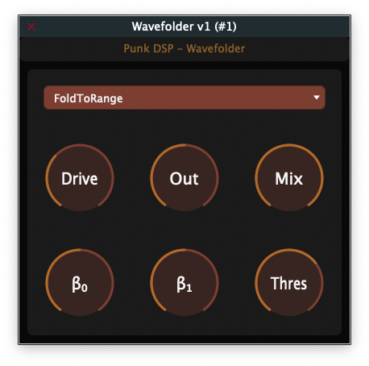

# Wavefolder
A JUCE audio plugin to showcase the behaviour of the wavefolder in my module: punk_dsp

## Introduction
This is a VST3/AU tube modeling plugin made with [JUCE](https://juce.com/). The sole purpose of this plugin is to showcase and test the performance of my `Wavefolder` class in [punk_dsp](https://github.com/gmoican/punk_dsp).

## Plugins that make use of this compressor
* Nothing for the moment...

